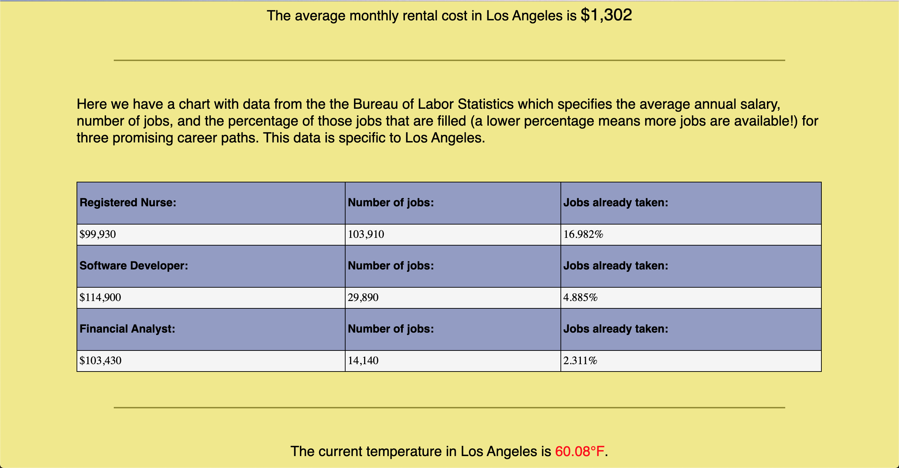

# bigCity

App that shows you a model of what to expect financially before moving to a new city.

https://alexjhidalgo.github.io/bigCity/

This is an app to get a quick view of relevant figures to a large city for people wanting to move there. The app briefs a user on cost of living, average salaries for 3 in demand jobs, and general weather patterns.

Uses HTML5, CSS3, JavaScript, and jQuery.

